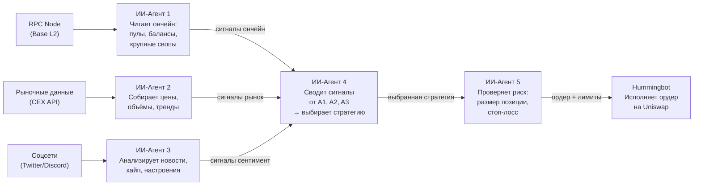

# Искусственный Интеллект для торговли криптой

## О чём эта презентация

Как построить систему ИИ-агентов, которая торгует криптовалютой на децентрализованных биржах (Uniswap на Base), анализирует рынок в реальном времени, адаптирует стратегии под изменяющиеся условия, и при этом не сливает депозит. Всё — с открытым исходным кодом, на своих серверах, без посредников.

---

## 1. Почему «просто взять и написать ИИ-агента» — недостаточно

Новичок думает: *«Скажу ChatGPT "торгуй криптой" — и готово».* Реальность сложнее.

ИИ-агенту для торговли на DEX нужно **четыре источника данных**, и каждый требует отдельной инфраструктуры:

| Источник | Что даёт | Как получить |
|----------|----------|--------------|
| **On-chain данные** | Балансы, пулы ликвидности, курсы токенов, история свопов | Поднять свою RPC-ноду (Ethereum / Base) или использовать провайдера (Alchemy, Infura) |
| **Рыночные данные** | Цены с CEX (Binance, Coinbase), объёмы, волатильность, настроения | API бирж + агрегаторы (CoinGecko, DefiLlama) |
| **Социальные сигналы** | Twitter, Discord, Telegram проекта — анонсы, хайп, FUD | Парсинг + sentiment analysis |
| **Исторические данные** | Бэктестинг стратегий на прошлых данных | Dune Analytics, The Graph, собственное хранилище |

**Пример на Base + Uniswap V3:**
- Нужна RPC-нода Base (L2 Ethereum) — чтобы читать контракты Uniswap, пулы, свопы
- Нужен провайдер RPC (Alchemy бесплатно — 300M запросов/мес) — поднять свою ноду Base дорого
- Нужно понимать ABI контрактов Uniswap V3 (Router, Factory, Quoter, Position Manager)
- Нужен `ethers.js` или `viem` для отправки транзакций

**Вывод:** агент без доступа к блокчейну — слепой. Агент без доступа к рынку — глухой. Нужна экосистема агентов, каждый со своим доступом к данным.

---

## 2. Архитектура: как это работает

В центре системы — цепочка ИИ-агентов, где каждый получает данные, обрабатывает и передаёт результат следующему. Ниже — упрощённая схема этого конвейера:



**Как читать схему:**

1. **Данные заходят** — RPC-нода, биржи, соцсети поставляют сырые данные трём агентам-аналитикам (A1, A2, A3)
2. **Анализ** — каждый агент смотрит на свой кусок данных и формирует сигнал: «в пуле Uniswap появилась крупная ликвидность», «цена пробила скользящую среднюю», «в Discord проекта анонсировали партнёрство»
3. **Синтез (A4)** — сводный агент получает сигналы от всех трёх аналитиков и решает: *какая стратегия лучше всего подходит под текущую картину?*
4. **Риск-контроль (A5)** — последний агент перед исполнением проверяет: *не слишком ли большой размер позиции? Где стоп-лосс? Не превышен ли дневной лимит убытков?*
5. **Исполнение** — готовый ордер с параметрами уходит в Hummingbot, который выставляет его на Uniswap

**Ключевой принцип:** ни один агент не торгует в одиночку. Каждый делает свою часть работы и передаёт эстафету дальше по цепочке.

---

## 3. Зачем нужно несколько агентов

Один агент = одна точка отказа. Рынок сложный — нужна специализация:

| Агент | Роль | Частота |
|-------|------|---------|
| **On-Chain Agent** | Мониторит мемпул, пулы ликвидности, крупные свопы. Находит опережающие сигналы до того как цена изменилась | Каждые 2-5 секунд |
| **Market Data Agent** | Собирает цены с CEX, считает спреды, волатильность, объёмы. Выявляет тренды | Каждые 30-60 секунд |
| **Sentiment Agent** | Анализирует Twitter/Discord проекта. Ловит анонсы до того как их заметил рынок | Каждые 5-15 минут |
| **Backtest Agent** | Прогоняет стратегии на исторических данных. Отвечает: «а что было бы, если бы мы торговали эту стратегию последний месяц?» | По запросу / раз в час |
| **Orchestrator Agent** | Собирает выводы аналитиков, выбирает стратегию, передаёт Risk Agent'у | Каждую минуту |
| **Risk Agent** | Считает размер позиции, стоп-лосс, максимальный допустимый убыток на день. Блокирует сделку если риск > порога | На каждую сделку |

---

## 4. Где брать стратегии

**Готовые стратегии (стартовая точка):**

- Hummingbot поставляется с 10+ встроенными стратегиями: Pure Market Making, Cross-Exchange Market Making, Avellaneda-Stoikov, AMM Arbitrage, Perpetual Market Making
- [hummingbot.org/strategies](https://hummingbot.org/strategies/) — документация и параметры
- Сообщество Hummingbot публикует кастомные стратегии на GitHub и Discord

**Что делаем сами:**

Стратегия — это не просто «купи дёшево, продай дорого». В контексте ИИ — это функция, которая принимает на вход сигналы от агентов-аналитиков и возвращает действие:

```
Стратегия = f(сигнал_ончейн, сигнал_рынок, сигнал_сентимент, параметры_риска) → {BUY, SELL, HOLD, ADD_LIQUIDITY, ...}
```

**Адаптация стратегий.** Рынок меняется: стратегия, работавшая в боковике, сливает в тренде. Нужна адаптация:

1. **Переключение стратегий** — Orchestrator выбирает стратегию под текущий режим рынка (тренд/флэт/высокая волатильность)
2. **Динамические параметры** — risk agent подстраивает размер позиции, спред, частоту под волатильность
3. **A/B тестирование** — две стратегии работают параллельно на бумажной торговле; побеждает та, у которой выше Sharpe ratio за период
4. **Генетические алгоритмы** — ИИ перебирает параметры стратегии, оптимизируя под последние N дней рынка

---

## 5. Hummingbot — готовый движок для исполнения

**[Hummingbot](https://hummingbot.org/)** — open-source бот для algorithmic trading. Не надо писать движок с нуля.

**Что Hummingbot уже умеет:**
- Подключение к CEX (Binance, Coinbase, Kraken, 30+) и DEX (Uniswap, PancakeSwap, dYdX)
- Лимитные и рыночные ордера, сеточная торговля
- Бумажная торговля (paper trading) с виртуальным балансом
- Бэктестинг стратегий на исторических данных
- Веб-интерфейс (Hummingbot Dashboard)
- Telegram-уведомления

**Что мы добавляем (ИИ-надстройка):**
- Агенты-аналитики (см. архитектуру выше) → передают сигналы в Hummingbot через API
- Orchestrator → выбирает стратегию и параметры
- Risk Agent → устанавливает лимиты через Hummingbot API
- MCP-сервер для Hummingbot → агенты отдают команды на исполнение

**Схема интеграции:**

```
ИИ-Агенты (анализ, стратегия)
        ↓  (MCP Server)
  Hummingbot Gateway API
        ↓
  Hummingbot Core (исполнение)
        ↓
  Uniswap V3 (Base L2)
```

---

## 6. Бумажная торговля — железное правило

> **Никогда не давайте агенту реальные деньги до того как он докажет прибыльность на виртуальном балансе.**

**Почему:**
- Стратегия может содержать логическую ошибку, которая видна только на реальных данных
- Рыночные условия могут измениться между бэктестом и живой торговлей
- Агент может неправильно интерпретировать сигнал и открыть убыточную позицию
- Ошибка в смарт-контракте или ABI = потеря всех средств

**Процесс:**

1. **Бумажная торговля (Paper Trading)** — минимум 2 недели, все агенты работают, но с виртуальным балансом
2. **Минимальный реальный депозит** — $50-100, только одна стратегия, жёсткий стоп-лосс
3. **Постепенное масштабирование** — увеличивать баланс на 20% в неделю, только если предыдущая неделя в плюсе
4. **Kill switch** — если дневной убыток > 5% депозита, все агенты останавливаются до ручного разбора

---

## 7. Навыки, MCP-сервера и контекст агентов

Чтобы агенты работали как команда, каждому нужны:

| Компонент | Зачем | Пример |
|-----------|-------|--------|
| **Agent Skills** | Специализированные инструкции: анализ on-chain данных, работа с ABI, расчёт метрик | `@onchain-analyst`, `@risk-manager`, `@backtest-engine` |
| **MCP-сервера** | Дают агенту доступ к внешним системам: RPC-нода, Hummingbot API, база данных | SupaBase MCP (хранение сигналов), Alchemy MCP (чтение блокчейна), Hummingbot MCP (исполнение) |
| **Контекст** | Исторические данные, параметры стратегий, правила риск-менеджмента, журнал сделок | AGENTS.md с правилами торговли, DATABASE.md со схемой данных, STRATEGIES.md с параметрами |

**Пример AGENTS.md для торгового агента:**

```
ROLE: Risk Manager Agent

INPUT: сигнал от Orchestrator с предложенной сделкой
OUTPUT: approve/reject + параметры (размер позиции, стоп-лосс)

RULES:
- Максимальный размер позиции = 5% депозита
- Стоп-лосс = -2% от размера позиции
- Максимальный дневной убыток = -10% депозита (kill switch)
- Не открывать позицию если волатильность за 1ч > 15%
- Не торговать токенами с ликвидностью < $100K
- Проверять slippage перед каждой сделкой
```

---

## 8. Что нужно знать чтобы создавать таких ботов с нуля

Ниже — обязательный минимум знаний и навыков. Порядок — от фундамента к готовой системе.

**Инструменты разработки:**

- GitHub — версионирование стратегий, конфигов, кода агентов
- Zed + DeepSeek — вся разработка через AI-промпты

**Блокчейн и DeFi — база:**

- Как работает Ethereum и L2-сети (Base). Что такое газ, транзакции, блоки, финализация
- Как работает Uniswap V3: пулы ликвидности, AMM, свопы, проскальзывание (slippage), комиссии, диапазоны ликвидности
- Что такое ABI контракта и как через него вызывать функции (swap, addLiquidity, collectFees)
- Как читать ончейн-данные: балансы, события (events), состояние пулов

**ИИ-агенты — ядро системы:**

- Skills и AGENTS.md — каждый агент получает специализированные инструкции (роль, правила, ограничения)
- Multi-agent architecture — оркестратор, аналитики, риск-менеджер. Как агенты обмениваются сигналами
- Оптимизация контекста — чтобы агент не забывал правила во время многочасовой торговли

**Работа с данными:**

- Поднять RPC-ноду (Alchemy бесплатный тариф — 300M запросов/мес) для чтения блокчейна
- Web3-библиотеки: ethers.js или viem — отправка транзакций, вызов контрактов, чтение событий
- SupaBase — хранение сигналов, сделок, метрик стратегий
- API бирж и агрегаторов — CoinGecko, Binance API, рыночные данные

**Инфраструктура:**

- Свой сервер (VPS) — Hetzner/DigitalOcean. Установка Linux, SSH, файрвол
- Hummingbot — установка, конфигурация, подключение кошелька, стратегии
- MCP-сервера — связь между ИИ-агентами и Hummingbot (агент отдаёт команду → Hummingbot исполняет)
- PM2 — авто-перезапуск агентов и бота при падении
- Telegram-бот — оповещения о сделках, kill switch, ежедневный PnL-отчёт

**Безопасность:**

- Приватные ключи — никогда не хранить в коде, только в `.env`, который в `.gitignore`
- Бумажная торговля — минимум 2 недели на виртуальном балансе перед реальными деньгами
- Лимиты риска — максимальный размер позиции, стоп-лосс, дневной лимит убытков
- Kill switch — автоматическая остановка всех агентов при убытке > порога

**Анализ и метрики:**

- Бэктестинг — прогон стратегии на исторических данных перед запуском
- Ключевые метрики: PnL, Sharpe ratio, win rate, maximum drawdown, profit factor
- LLM Wiki — журнал сделок, агенты пишут отчёт после каждой торговой сессии

---

## 9. Итог: минимальный стек для старта

```
├── Agents (Zed + DeepSeek)
│   ├── Orchestrator Agent
│   ├── On-Chain Agent (Alchemy RPC → Base)
│   ├── Market Data Agent (CoinGecko API)
│   ├── Sentiment Agent (Twitter API)
│   ├── Backtest Agent (Dune Analytics)
│   └── Risk Agent
│
├── Execution
│   └── Hummingbot (на своём VPS)
│       └── Стратегия: Pure Market Making + ИИ-адаптация
│
├── Data Storage (SupaBase)
│   ├── signals (сигналы агентов)
│   ├── trades (исполненные сделки)
│   └── metrics (PnL, Sharpe, win rate)
│
├── Infrastructure
│   ├── Alchemy RPC (Base L2)
│   ├── VPS (Hetzner $4/мес или собственный сервер)
│   └── PM2 (авто-перезапуск)
│
└── Monitoring
    ├── Telegram Bot (оповещения)
    └── LLM Wiki (журнал + анализ)
```

**С чего начать прямо сейчас:**
1. Поднять Hummingbot на сервере и запустить paper trading с готовой стратегией
2. Написать On-Chain Agent, который читает данные из Uniswap V3 пулов через Alchemy
3. Подключить Market Data Agent (CoinGecko бесплатный API)
4. Запустить связку из двух агентов на бумажной торговле
5. Когда бумажная торговля стабильно в плюсе 2+ недели — минимальный реальный депозит

---

## Связанные материалы

- [[off-line-lesson-01]] — GitHub, Zed, DeepSeek & Context Optimization
- [[off-line-lesson-02]] — Architecture, Design & AI Agent Team
- [[off-line-lesson-03]] — Deployment & Databases (fly.io, SupaBase, own server)
- [[off-line-lesson-04]] — Autonomous AI Agent with Memory
- [[off-line-lesson-05]] — AI Marketing Team
- [[off-line-lesson-06]] — Diploma Project
- [[lesson-04-ai-agents-team]] — Команда ИИ-агентов
- [[lesson-05-llm-wiki]] — LLM Wiki, второй мозг
- [[lesson-06-database]] — База данных
- [[lesson-08-production-deployment]] — Деплой в production
- [[guide-agent-skills-installation]] — Установка и использование Agent Skills
