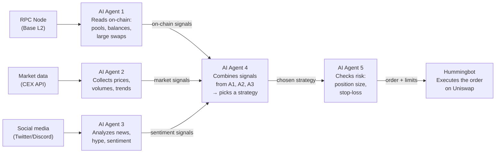

# Artificial Intelligence for Crypto Trading

How to build a system of AI agents that trades cryptocurrency on decentralized exchanges (Uniswap on Base), analyzes the market in real time, adapts strategies to changing conditions, and doesn't drain the deposit in the process. All of it open-source, running on your own servers, with no intermediaries.

---

## 1. Why "just tell an AI to trade crypto" is not enough

A beginner thinks: *"I'll tell ChatGPT to 'trade crypto' — and that's it."* Reality is more complicated.

An AI agent trading on a DEX needs **four data sources**, and each one requires its own infrastructure:

| Source | What it gives you | How to get it |
|----------|----------|--------------|
| **On-chain data** | Balances, liquidity pools, token prices, swap history | Run your own RPC node (Ethereum / Base) or use a provider |
| **Market data** | Prices from CEXes (Binance, Coinbase), volumes, volatility, sentiment | Exchange APIs + aggregators (CoinGecko, DefiLlama) |
| **Social signals** | Twitter, Discord, Telegram of the project — announcements, hype, FUD | Scraping + sentiment analysis |
| **Historical data** | Backtesting strategies on past data | Dune Analytics, The Graph, your own storage |

**An example on Base + Uniswap V3:**
- You need a Base RPC node (an Ethereum L2) — to read Uniswap contracts, pools, swaps
- You need an RPC provider — running your own Base node is expensive, what are the alternatives?
- You need to understand the ABI of the Uniswap V3 contracts (Router, Factory, Quoter, Position Manager)
- You need `ethers.js` or `viem` to send transactions

**Takeaway:** an agent without blockchain access is blind. An agent without market access is deaf. You need an ecosystem of agents, each with its own data access.

---

## 2. Architecture: how it works

At the center of the system is a chain of AI agents, where each one receives data, processes it, and passes the result to the next. Below is a simplified diagram of this pipeline:



**How to read the diagram:**

1. **Data flows in** — the RPC node, exchanges and social media feed raw data to the three analyst agents (A1, A2, A3)
2. **Analysis** — each agent looks at its own slice of data and forms a signal: "large liquidity just appeared in a Uniswap pool", "the price broke through the moving average", "the project announced a partnership on Discord"
3. **Synthesis (A4)** — the consolidating agent receives signals from all three analysts and decides: *which strategy fits the current market picture best?*
4. **Risk control (A5)** — the last agent before execution checks: *is the position size too big? Where is the stop-loss? Has the daily loss limit been exceeded?*
5. **Execution** — the finished order with its parameters goes to Hummingbot, which places it on Uniswap

**Key principle:** no agent trades alone. Each one does its part of the work and passes the baton further down the chain.

---

## 3. Why you need multiple agents

One agent = a single point of failure. The market is complex — you need specialization:

| Agent | Role | Frequency |
|-------|------|---------|
| **On-Chain Agent** | Monitors the mempool, liquidity pools, large swaps. Finds leading signals before the price moves | Every 2-5 seconds |
| **Market Data Agent** | Collects prices from CEXes, computes spreads, volatility, volumes. Detects trends | Every 30-60 seconds |
| **Sentiment Agent** | Analyzes the project's Twitter/Discord. Catches announcements before the market notices them | Every 5-15 minutes |
| **Backtest Agent** | Runs strategies on historical data. Answers: "what would have happened if we had traded this strategy for the last month?" | On demand / once an hour |
| **Orchestrator Agent** | Collects the analysts' conclusions, picks a strategy, passes it to the Risk Agent | Every minute |
| **Risk Agent** | Computes the position size, stop-loss, maximum acceptable daily loss. Blocks a trade if the risk exceeds the threshold | For every trade |

---

## 4. Where to get strategies

**Ready-made strategies (a starting point):**

- Hummingbot ships with 10+ built-in strategies: Pure Market Making, Cross-Exchange Market Making, Avellaneda-Stoikov, AMM Arbitrage, Perpetual Market Making
- [hummingbot.org/strategies](https://hummingbot.org/strategies/) — documentation and parameters
- The Hummingbot community publishes custom strategies on GitHub and Discord

**What we build ourselves:**

A strategy is not just "buy low, sell high". In an AI context, it's a function that takes the analyst agents' signals as input and returns an action:

```
Strategy = f(on_chain_signal, market_signal, sentiment_signal, risk_parameters) → {BUY, SELL, HOLD, ADD_LIQUIDITY, ...}
```

**Strategy adaptation.** The market changes: a strategy that worked in a sideways market bleeds in a trend. You need adaptation:

1. **Strategy switching** — the Orchestrator picks a strategy for the current market regime (trend / flat / high volatility)
2. **Dynamic parameters** — the risk agent adjusts the position size, spread and frequency to the volatility
3. **A/B testing** — two strategies run in parallel on paper trading; the one with the higher Sharpe ratio over the period wins
4. **Genetic algorithms** — the AI iterates over strategy parameters, optimizing for the last N days of the market

---

## 5. Hummingbot — a ready-made execution engine

**[Hummingbot](https://hummingbot.org/)** — an open-source bot for algorithmic trading. No need to write an engine from scratch.

**What Hummingbot already does:**
- Connects to CEXes (Binance, Coinbase, Kraken, 30+) and DEXes (Uniswap, PancakeSwap, dYdX)
- Limit and market orders, grid trading
- Paper trading with a virtual balance
- Backtesting strategies on historical data
- Web interface (Hummingbot Dashboard)
- Telegram notifications

**What we add on top (the AI layer):**
- Analyst agents (see the architecture above) → pass signals to Hummingbot via the API
- Orchestrator → picks the strategy and parameters
- Risk Agent → sets limits via the Hummingbot API
- An MCP server for Hummingbot → agents issue execution commands

**Integration diagram:**

```
AI Agents (analysis, strategy)
        ↓  (MCP Server)
  Hummingbot Gateway API
        ↓
  Hummingbot Core (execution)
        ↓
  Uniswap V3 (Base L2)
```

---

## 6. Paper trading — the iron rule

> **Never give an agent real money until it has proven profitability on a virtual balance.**

**Why:**
- A strategy may contain a logic error that only shows up on real data
- Market conditions may change between the backtest and live trading
- The agent may misinterpret a signal and open a losing position
- A mistake in a smart contract or ABI = losing all funds

**The process:**

1. **Paper trading** — at least 2 weeks, all agents run, but with a virtual balance
2. **Minimum real deposit** — $50-100, a single strategy, a hard stop-loss
3. **Gradual scaling** — increase the balance by 20% per week, only if the previous week was profitable
4. **Kill switch** — if the daily loss exceeds 5% of the deposit, all agents stop until a manual review

---

## 7. Skills, MCP servers and agent context

For agents to work as a team, each one needs:

| Component | Why | Example |
|-----------|-------|--------|
| **Agent Skills** | Specialized instructions: on-chain data analysis, working with ABIs, computing metrics | `@onchain-analyst`, `@risk-manager`, `@backtest-engine` |
| **MCP servers** | Give the agent access to external systems: RPC node, Hummingbot API, database | SupaBase MCP (storing signals), Alchemy MCP (reading the blockchain), Hummingbot MCP (execution) |
| **Context** | Historical data, strategy parameters, risk-management rules, trade journal | AGENTS.md with trading rules, DATABASE.md with the data schema, STRATEGIES.md with parameters |

**Example AGENTS.md for a trading agent:**

```
ROLE: Risk Manager Agent

INPUT: a signal from the Orchestrator with a proposed trade
OUTPUT: approve/reject + parameters (position size, stop-loss)

RULES:
- Maximum position size = 5% of the deposit
- Stop-loss = -2% of the position size
- Maximum daily loss = -10% of the deposit (kill switch)
- Do not open a position if 1h volatility > 15%
- Do not trade tokens with liquidity < $100K
- Check slippage before every trade
```

---

## 8. What you need to know to build such bots from scratch

Below is the required minimum of knowledge and skills. The order goes from fundamentals to a finished system.

**Development tools:**

- GitHub — versioning of strategies, configs, agent code
- IDE + LLM — all development through AI prompts

**Blockchain and DeFi — the basics:**

- How Ethereum and L2 networks (Base) work. What gas, transactions, blocks and finality are
- How Uniswap V3 works: liquidity pools, AMM, swaps, slippage, fees, liquidity ranges
- What a contract ABI is and how to call functions through it (swap, addLiquidity, collectFees)
- How to read on-chain data: balances, events, pool state

**AI agents — the core of the system:**

- Skills and AGENTS.md — each agent gets specialized instructions (role, rules, constraints)
- Multi-agent architecture — orchestrator, analysts, risk manager. How agents exchange signals
- Context optimization — so an agent doesn't forget the rules during hours-long trading

**Working with data:**

- Calling an RPC node to read the blockchain
- Web3 libraries: ethers.js or viem — sending transactions, calling contracts, reading events
- Databases — storing signals, trades, strategy metrics
- Exchange and aggregator APIs — market data

**Infrastructure:**

- Your own server (VPS) — Linux setup, SSH, firewall
- Hummingbot — installation, configuration, wallet connection, strategies
- MCP servers — the link between AI agents and Hummingbot (the agent issues a command → Hummingbot executes it)
- PM2 — auto-restart of the agents and the bot on failure
- Telegram bot — trade alerts, kill switch, daily PnL report

**Security:**

- Private keys — never store them in code, only in `.env`, which is in `.gitignore`
- Paper trading — at least 2 weeks on a virtual balance before real money
- Risk limits — maximum position size, stop-loss, daily loss limit
- Kill switch — automatic stop of all agents when the loss exceeds the threshold

**Analysis and metrics:**

- Backtesting — running the strategy on historical data before launch
- Key metrics: PnL, Sharpe ratio, win rate, maximum drawdown, profit factor
- LLM Wiki — a trade journal; agents write a report after every trading session

---

## 9. Summary: the minimal stack to start

```
├── Agents 
│   ├── Orchestrator Agent
│   ├── On-Chain Agent (RPC → Base)
│   ├── Market Data Agent (API)
│   ├── Sentiment Agent (Twitter API)
│   ├── Backtest Agent (API)
│   └── Risk Agent
│
├── Execution
│   └── Hummingbot (on your own VPS)
│       └── Strategy: Pure Market Making + AI adaptation
│
├── Data Storage 
│   ├── signals (agent signals)
│   ├── trades (executed trades)
│   └── metrics (PnL, Sharpe, win rate)
│
├── Infrastructure
│   ├── Alchemy RPC (Base L2)
│   ├── VPS ($4/month or your own server)
│   └── PM2 (auto-restart)
│
└── Monitoring
    ├── Telegram Bot (alerts)
    └── LLM Wiki (journal + analysis)
```

---

If you're interested in how this can be done, we've developed a 10-session course: [AI Agents for Crypto Trading](https://github.com/Distributed-Validators-Synctems/AI-School/blob/master/AI-crypto-trading-course.md)
